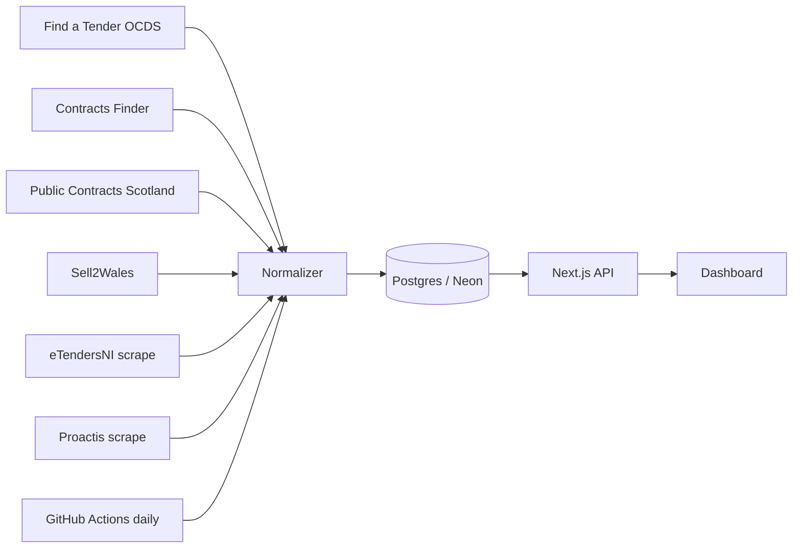

# UK Government Contracts Platform

Unified ingestion and dashboard for UK public procurement across **England, Scotland, Wales, and Northern Ireland**.

## Architecture



## Stack

- **Frontend:** Next.js 16, React 19, TypeScript, Tailwind, shadcn-style components, Recharts
- **Backend:** Next.js read APIs + dashboard (deployed on Vercel)
- **Database:** Postgres via Neon + Drizzle ORM
- **Ingestion:** standalone Node pipeline (`scripts/backfill.ts`) run via GitHub Actions — OCDS APIs (FTS, Contracts Finder, PCS) + HTTP scrape (Sell2Wales, Proactis, and eTendersNI with a self-hosted OCR CAPTCHA solver)

## Quick start

```bash
cd uk-tender-aggregator
cp .env.example .env.local
# Set DATABASE_URL

npm install
npm run db:migrate
npm run ingest:backfill -- --days=30
npm run dev
```

Open [http://localhost:3000](http://localhost:3000).

### Ingest specific sources

```bash
npm run ingest:fts
npm run ingest:cf
npm run ingest:backfill -- --days=30 --sources=pcs,sell2wales
npm run ingest:once
```

### Environment variables

- `DATABASE_URL`: Postgres connection string (Neon or local)
- `NEXT_PUBLIC_APP_URL`: Public base URL (used in user agent contact)
- `SCRAPER_USER_AGENT`: Optional custom user agent for scrapers
- `INGEST_TLS_SKIP_VERIFY`: Set true if PCS/Sell2Wales TLS fails locally
- `ETENDERS_CAPTCHA_ATTEMPTS`: Optional, max OCR retry attempts for the eTendersNI CAPTCHA (default 25)

The eTendersNI image CAPTCHA is solved by our own OCR solver
([lib/ingest/captcha.ts](lib/ingest/captcha.ts), Tesseract + preprocessing + retry) —
no third-party CAPTCHA service or headless browser required.

## Ingestion / scheduling

All ingestion runs in **GitHub Actions** ([.github/workflows/ingest.yml](.github/workflows/ingest.yml)),
calling `scripts/backfill.ts` directly against the database — the deployed Vercel
app serves only the dashboard and read APIs.

- **Scheduled:** daily at 03:00 UTC.
- **Manual / on-demand:** trigger the workflow with **Run workflow** (`workflow_dispatch`),
  with optional `days` and `sources` inputs.
- **Setup:** add the repo secret `DATABASE_URL` (Actions → Secrets). Locally you
  can still run `npm run ingest:backfill` against your own `DATABASE_URL`.

## Portal coverage

See [docs/coverage.md](docs/coverage.md).

| Source                    | Nation                    | Method                               |
| ------------------------- | ------------------------- | ------------------------------------ |
| Find a Tender             | UK-wide                   | OCDS release packages API            |
| Contracts Finder          | England / below-threshold | OCDS search API (cursor)             |
| Public Contracts Scotland | Scotland                  | OCDS `/v1/Notices`                   |
| Sell2Wales                | Wales                     | HTML scrape (robots.txt respected)   |
| eTendersNI                | Northern Ireland          | HTTP scrape + self-hosted OCR CAPTCHA |
| Proactis (ProContract)    | England                   | HTML scrape (robots.txt respected)   |

## Unified schema

All timestamps are stored as `timestamp with time zone` and normalized to ISO 8601 UTC.

### Enums

| Name                 | Values                                                        |
| -------------------- | ------------------------------------------------------------- |
| `source`             | fts, contracts_finder, pcs, sell2wales, etenders_ni, proactis |
| `nation`             | england, scotland, wales, northern_ireland, uk                |
| `opportunity_status` | planning, active, award, complete, cancelled, unknown         |

### buyers

| Column              | Type                     | Notes             |
| ------------------- | ------------------------ | ----------------- |
| `id`                | text                     | Primary key       |
| `name`              | text                     | Required          |
| `identifier_scheme` | text                     |                   |
| `identifier_id`     | text                     |                   |
| `address`           | jsonb                    |                   |
| `nation`            | `nation`                 |                   |
| `buyer_type`        | text                     |                   |
| `created_at`        | timestamp with time zone | Defaults to now() |
| `updated_at`        | timestamp with time zone | Defaults to now() |

### opportunities

| Column            | Type                     | Notes                                                       |
| ----------------- | ------------------------ | ----------------------------------------------------------- |
| `id`              | text                     | Primary key; `sha256(source:ocid:releaseId)` (first 32 hex) |
| `ocid`            | text                     |                                                             |
| `source`          | `source`                 | Required                                                    |
| `nation`          | `nation`                 | Required; default `uk`                                      |
| `region`          | text                     |                                                             |
| `title`           | text                     | Required                                                    |
| `description`     | text                     |                                                             |
| `status`          | `opportunity_status`     | Required; default `unknown`                                 |
| `procedure_type`  | text                     |                                                             |
| `industry_codes`  | text[]                   |                                                             |
| `industry_labels` | text[]                   |                                                             |
| `value_amount`    | numeric(18, 2)           |                                                             |
| `value_currency`  | text                     | Default `GBP`                                               |
| `value_min`       | numeric(18, 2)           |                                                             |
| `value_max`       | numeric(18, 2)           |                                                             |
| `published_at`    | timestamp with time zone |                                                             |
| `deadline_at`     | timestamp with time zone |                                                             |
| `award_date`      | timestamp with time zone |                                                             |
| `buyer_id`        | text                     | FK -> buyers.id                                             |
| `buyer_name`      | text                     |                                                             |
| `buyer_type`      | text                     |                                                             |
| `source_url`      | text                     |                                                             |
| `documents`       | jsonb                    | Array of `{ title?, url, format? }`                         |
| `raw_ocds`        | jsonb                    | Full release JSONB for audit                                |
| `content_tsv`     | tsvector                 | Full-text search index                                      |
| `created_at`      | timestamp with time zone | Defaults to now()                                           |
| `updated_at`      | timestamp with time zone | Defaults to now(); required                                 |

### ingestion_runs

| Column             | Type                     | Notes             |
| ------------------ | ------------------------ | ----------------- |
| `id`               | text                     | Primary key       |
| `source`           | `source`                 | Required          |
| `started_at`       | timestamp with time zone | Required          |
| `finished_at`      | timestamp with time zone |                   |
| `records_fetched`  | integer                  | Default 0         |
| `records_upserted` | integer                  | Default 0         |
| `errors`           | jsonb                    | Array of strings  |
| `status`           | text                     | Default `running` |

### dead_letter_queue

| Column            | Type                     | Notes             |
| ----------------- | ------------------------ | ----------------- |
| `id`              | text                     | Primary key       |
| `source`          | `source`                 | Required          |
| `payload`         | jsonb                    |                   |
| `error`           | text                     | Required          |
| `attempts`        | integer                  | Default 1         |
| `last_attempt_at` | timestamp with time zone | Defaults to now() |
| `created_at`      | timestamp with time zone | Defaults to now() |

## API

| Endpoint                                | Description                               |
| --------------------------------------- | ----------------------------------------- |
| `GET /api/opportunities`                | List all opportunities in json format     |
| `GET /api/opportunities/:id`            | Detail of opportunity with specified `id` |
| `GET /api/stats`                        | Dashboard aggregates stats                |
| `GET /api/export/ocds?format=csv\|json` | CSV export or OCDS release package export |
| `GET /api/health`                       | DB connectivity                           |

### Filter params

`/api/opportunities` supports: `q`, `nation`, `status`, `buyerType`, `industry`,
`valueMin`, `valueMax`, `deadlineFrom`, `deadlineTo`, `page`, `pageSize`, `sort`, `order`.

## AI usage

Documented in [docs/ai-usage.md](docs/ai-usage.md).

## Metrics

Documented in [docs/metrics.md](docs/metrics.md).

## Ground rules compliance

- Respects `robots.txt` (eTendersNI)
- Exponential backoff on API failures
- Identifying User-Agent
- No login/paywall bypass - documented limitations in coverage doc
- Dead-letter queue for permanent ingest errors
