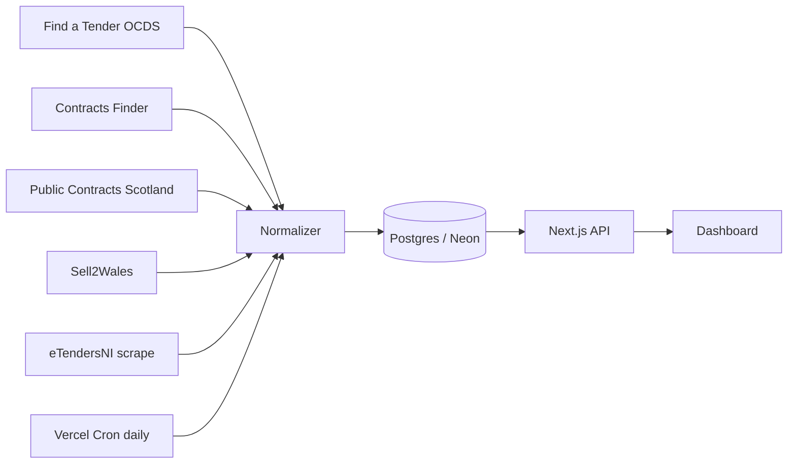

# UK Government Contracts Platform

Unified ingestion and dashboard for UK public procurement across **England, Scotland, Wales, and Northern Ireland**.

## Architecture



## Stack

- **Frontend:** Next.js 14, TypeScript, Tailwind, shadcn-style components, Recharts
- **Backend:** Next.js API routes (monolith)
- **Database:** Postgres via Neon + Drizzle ORM
- **Ingestion:** OCDS APIs (FTS, Contracts Finder, PCS, Sell2Wales) + HTML scrape (eTendersNI)

## Quick start

```bash
cd uk-gov-contracts
cp .env.example .env.local
# Set DATABASE_URL (Neon) and CRON_SECRET

npm install
npm run db:migrate
npm run ingest:backfill -- --days=30
npm run dev
```

Open [http://localhost:3000](http://localhost:3000).

### Ingest specific sources

```bash
npm run ingest:fts
npm run ingest:cf
npm run ingest:backfill -- --days=30 --sources=pcs,sell2wales
```

## Portal coverage

See [docs/coverage.md](docs/coverage.md).

| Source                    | Nation                    | Method                                  |
| ------------------------- | ------------------------- | --------------------------------------- |
| Find a Tender             | UK-wide                   | OCDS release packages API               |
| Contracts Finder          | England / below-threshold | OCDS search API (cursor)                |
| Public Contracts Scotland | Scotland                  | OCDS `/v1/Notices`                      |
| Sell2Wales                | Wales                     | OCDS API + bulk download fallback       |
| eTendersNI                | Northern Ireland          | Public HTML list (robots.txt respected) |

## Unified schema

| Field      | Notes                                          |
| ---------- | ---------------------------------------------- |
| `id`       | `sha256(source:ocid:releaseId)`                |
| Dates      | ISO 8601 UTC timestamps                        |
| Values     | Numeric + ISO 4217 currency                    |
| `nation`   | england, scotland, wales, northern_ireland, uk |
| `raw_ocds` | Full release JSONB for audit                   |

## API

| Endpoint                           | Description                            |
| ---------------------------------- | -------------------------------------- |
| `GET /api/opportunities`           | List with filters                      |
| `GET /api/opportunities/:id`       | Detail                                 |
| `GET /api/stats`                   | Chart aggregates                       |
| `GET /api/export?format=csv\|json` | Filtered export                        |
| `GET /api/export/ocds`             | OCDS release package export (stretch)  |
| `GET /api/cron/ingest`             | Daily ingestion (Bearer `CRON_SECRET`) |
| `GET /api/health`                  | DB connectivity                        |

## AI usage

Documented in [docs/ai-usage.md](docs/ai-usage.md).

## Metrics

Documented in [docs/metrics.md](docs/metrics.md).

## Ground rules compliance

- Respects `robots.txt` (eTendersNI)
- Exponential backoff on API failures
- Identifying User-Agent
- No login/paywall bypass - documented limitations in coverage doc
- Dead-letter queue for permanent ingest errors
